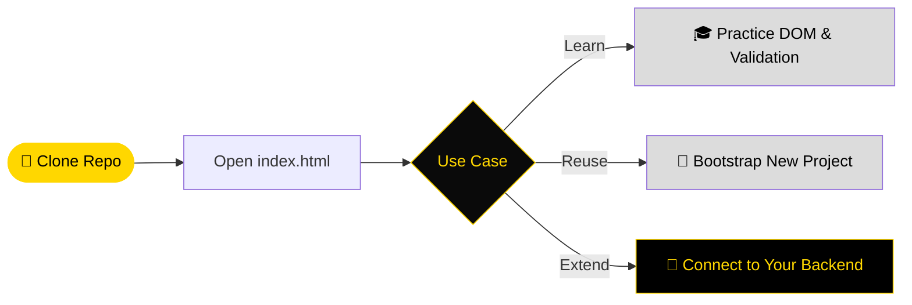

<div align="center">


[](https://git.io/typing-svg)

<br/>

<p align="center">
  <a href="https://committers.top/colombia">
    
  </a>
  
  
</p>

<p align="center">
  
  
  
  
  
</p>

<p align="center">
  <a href="https://github.com/NietoDeveloper/RegisterUserFront">
    
  </a>
</p>

<br/>

> **RegisterUserFront** — *A minimal, dependency-free vanilla JavaScript template for building user registration interfaces.*
>
> Built for learning, teaching, and reuse: plain HTML, modular CSS, and framework-free JS. No bundlers, no package manager, no build step — clone it, open it, and start coding.
>
> *Study Template · Fork-Friendly · Built in Bogotá 🇨🇴*

</div>

---

## 📖 About

**RegisterUserFront** is a lightweight, framework-free starter template for a user registration front-end. It exists for two purposes at once: as a **study resource** for practicing DOM manipulation, event handling, and client-side form validation in plain JavaScript, and as a **reusable base template** for quickly bootstrapping new front-end projects without the overhead of a framework or a build tool.

---

## 📂 Project Structure

```text
RegisterUserFront/
│
├── css/                      ← Stylesheets
│   └── style.css              ← Layout, form styling, responsive rules
│
├── js/                        ← Application logic
│   └── main.js                 ← DOM handling, event listeners, form validation
│
├── index.html                 ← Entry point (registration form markup)
├── LICENSE                    ← MIT License
└── README.md
```

---

## 🛠️ Technology Stack

<div align="center">

| Layer | Technology | Purpose |
|:------|:-----------|:--------|
| 🧱 **Structure** | HTML5 | Semantic markup for the registration form |
| 🎨 **Styling** | CSS3 | Modular, framework-free styling |
| ⚙️ **Logic** | Vanilla JavaScript (ES6+) | DOM manipulation, event handling, validation |
| 🐙 **Versioning** | Git & GitHub | Source control and collaboration |

</div>

No frameworks, no bundlers, no `node_modules` — just open the browser and code.

---

## ✨ Purpose & Use Cases

