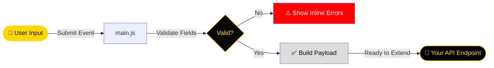

<div align="center">


[](https://git.io/typing-svg)

<br/>

<p align="center">
  
  
  
</p>

<p align="center">
  
  
  
  
  
</p>

<p align="center">
  <a href="https://github.com/NietoDeveloper/RegisterUserFront">
    
  </a>
  <a href="https://github.com/NietoDeveloper">
    
  </a>
</p>

<br/>

> **RegisterUserFront** — *A minimal, dependency-free vanilla JavaScript template for building user registration interfaces.*
>
> Built for learning, teaching, and reuse: plain HTML, modular CSS, and framework-free JS. No bundlers, no package manager, no build step — clone it, open it, and start coding.
>
> *Study Template · Fork-Friendly · Built in Bogotá 🇨🇴*

</div>

---

## 📖 About

**RegisterUserFront** is a lightweight, framework-free starter template for a user registration front-end. It is designed as both a **study resource** — to practice DOM manipulation, event handling, and client-side form validation in plain JavaScript — and a **reusable base template** for quickly bootstrapping new front-end projects without the overhead of a framework or build tool.

---

## 📂 Project Structure

```text
RegisterUserFront/
│
├── css/                       ← Stylesheets
│   └── style.css               ← Layout, form styling, responsive rules
│
├── js/                         ← Application logic
│   └── main.js                  ← DOM handling, event listeners, form validation
│
├── index.html                  ← Entry point (registration form markup)
├── LICENSE                     ← MIT License
└── README.md
```

---

## 🛠️ Technology Stack

<div align="center">

| Layer | Technology | Purpose |
|:------|:-----------|:--------|
| 🧱 **Structure** | HTML5 | Semantic markup for the registration form |
| 🎨 **Styling** | CSS3 | Modular, framework-free styling |
| ⚙️ **Logic** | Vanilla JavaScript (ES6+) | DOM manipulation, event handling, validation |
| 🐙 **Versioning** | Git & GitHub | Source control and collaboration |

</div>

No frameworks, no bundlers, no `node_modules` — just open the browser and code.

---

## ✨ Purpose & Use Cases


- 🎓 **Study template** — a clean reference for practicing vanilla JS form handling and validation patterns.
- 🧩 **Starter template** — fork it as the front-end base for any registration flow.
- 🔌 **Backend-agnostic** — plug in any REST API endpoint from `js/main.js` without extra tooling.

---

## 🔄 Form Validation Flow



---

## 🚀 Quick Start

**Step 1 — Clone the repository**

```bash
git clone https://github.com/NietoDeveloper/RegisterUserFront.git
cd RegisterUserFront
```

**Step 2 — Open it**

No install, no build step. Simply open `index.html` in your browser, or serve it locally for live reload:

```bash
# Optional: serve with any static file server
npx live-server
```

**Step 3 — Customize**

- Edit `css/style.css` to adjust layout, colors, and responsive rules.
- Edit `js/main.js` to change validation rules or connect the form to your own API.

---

## 🤝 Contributing

Contributions, issues, and feature requests are welcome. Feel free to fork this repository, open a pull request, or file an issue if you spot a bug or have a suggestion for improving the template.

---

## 📄 License

This project is licensed under the **MIT License** — see the [LICENSE](https://github.com/NietoDeveloper/RegisterUserFront/blob/main/LICENSE) file for details.

---

## 🔗 Links & Resources

<div align="center">

| Resource | Link |
|:---------|:-----|
| 📂 **GitHub Repository** | [github.com/NietoDeveloper/RegisterUserFront](https://github.com/NietoDeveloper/RegisterUserFront) |
| 👤 **Developer Profile** | [github.com/NietoDeveloper](https://github.com/NietoDeveloper) |
| 🏆 **#1 Colombia Ranking** | [committers.top/colombia](https://committers.top/colombia) |

</div>

---

<div align="center">

[](https://github.com/NietoDeveloper)
[](https://github.com/NietoDeveloper/RegisterUserFront/blob/main/LICENSE)

<br/>

```
╔══════════════════════════════════════════════════════════════════╗
║                                                                    ║
║   "A clean vanilla JS foundation — simple to study,               ║
║    simple to reuse, simple to extend."                            ║
║                                                                    ║
║                               — NietoDeveloper Standard            ║
╚══════════════════════════════════════════════════════════════════╝
```

*RegisterUserFront — Built by **NietoDeveloper · Manuel Nieto***

*Developed with technical rigor in* 📍 **Bogotá, Colombia** 🇨🇴

<br/>


</div>
